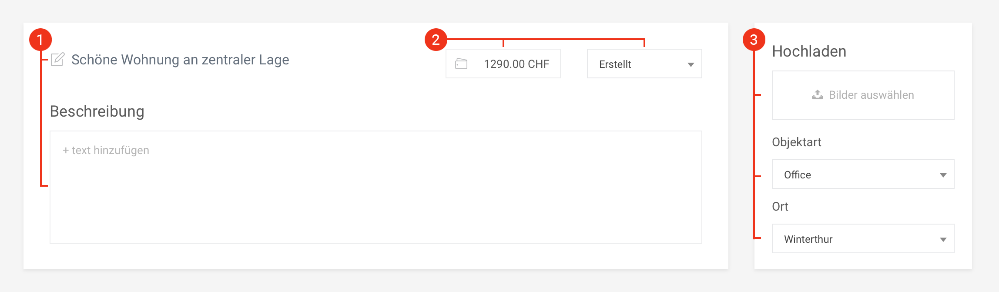

# SISKA Dashboard

### Table of contents:

* **Pages**
  * Home
  * Static
* **Immobilien**
  * [Sections](#immobilien---sections)
  * [Offers](#dashboard---Offers)

## Immobilien - Sections

### 1. New offer

**Description:** To create a new offer, click on the plus in the upper left corner of the page. After that, you will see a modal window with the following fields:

* **Angebotsname:** offer name is required
* **Preis:** also required, fill without specifying the currency type
* **Objektfotos:** photos are not required, and can be uploaded later

After saving, you will be redirected to the [offer page](#dashboard---Offers) where you can add complete information. The new offer will be assigned "Created" status and it will not be displayed on the site until the transition to the "Published".

### 2. Section settings

**Description:** To update information for the current section, click on the gear icon in the upper right corner of the page. After that, you will see a modal window where you can update the description and cover image.

* **Beschreibung:** the description should not be too long, 200-ish characters will be enough
* **Titelbild:** if the cover already exists it will be replaced after saving

If the cover exists, picture icon changes color to green. You can click on it for preview.

### 3. Offers grid

**Description:** Offer card contains basic information such as status, name, price, location, etc. To go to editing, hover and click on the offer card, also you can use the icon in the upper right corner, the page will open in a new tab.

For convenience, offers are divided into three sections by status:

1. **Erstellt:** recently added, have a blue color and do not display on the site
2. **Veröffentlicht:** published, have a green color and visible for the site visitors
3. **Archiviert:** not actual, have a gray color but can be restored

## Immobilien - Offers

### 1. Name, Description

**Name:** It is important to understand that when you change the name, you also change the URL address of the page. In the case when a user has bookmarked or posted this page on social networks URL may be lost.

**Description:** A detailed description of the offer. It is desirable to have a voluminous and unique text because this is useful for SEO.

### 2. Price, Status

**Status:** it changes the behavior of offers on the site and in the panel when you select one of them. Has the following cases:

* **Erstellt:** at the stage of filling, displayed in the top of the dashboard grid, but not visible for the site
* **Veröffentlicht:** actual offers that are visible to site visitors
* **Archiviert:** not actual offers, but may be updated and used in the future

### 3. Upload, Type, Location

**Upload:** you can upload multiple images at once, just click on the button and select everything you need. After uploading you will see them in [this block](#5-images).

**Type, Location:** These lists are optional but very important to fill out because they will be used to search for offers on the site.

### 4. Details

Characteristics of the offer, such as the number of rooms or floors, surface, equipment, etc. You can add any number of details, just fill the title and value and then click on the button with a refresh icon. You can also remove unnecessary details by clicking on the trash icon.

### 5. Images

This section will be hidden until you upload images. To delete an image, click on the trash icon.